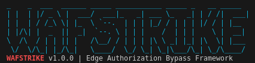

# WAFStrike ⚡

[WAFStrike Banner]<p align="center">
  
</p>

[](https://python.org)
[](LICENSE)
[](https://github.com/CyberSecPro-95/WAFStrike)

> A research-grade authorization testing framework v2.0.0 that confirms real authorization failures with high confidence through multi-layer analysis, WAF vs backend correlation, and state-aware validation.

## 🎯 Elevator Pitch

WAFStrike is an advanced authorization testing framework designed for modern security research and bug bounty programs. It combines identity context divergence testing, adaptive request logic, WAF vs backend decision correlation, and state-aware validation into a unified, research-grade testing engine that eliminates false positives and produces defensible findings.

## ✨ Features

- 🔬 **Authorization Validation** - Context-aware validation using identity, endpoint, and role information
- 🎯 **Identity Context Testing** - Multi-layer identity testing with privilege escalation detection
- 🧠 **Adaptive Request Logic** - Learns from target behavior and adapts request strategies
- 🛡️ **WAF vs Backend Correlation** - Distinguishes WAF blocks from backend authorization failures
- 📊 **State-Aware Confirmation** - Tracks authorization state across multiple requests
- 🎯 **Precision Payload Strategy** - Endpoint-aware, role-aware, identity-aware payloads
- 🔇 **Noise Suppression** - Automated false positive reduction with confidence scoring
- 📋 **Structured Reporting** - Bounty-ready reports with complete evidence
- 🔒 **Full Automation** - Complete workflow with safety controls and guardrails

## 🔒 Research Ethics

WAFStrike is designed **exclusively for authorized security research**. Users must have explicit permission to test target systems. This framework adheres to research-grade standards and responsible disclosure practices. Unauthorized use is strictly prohibited and violates ethical research principles.

## 🚀 Quick Start

### Basic Usage
```bash
# Full research-grade authorization analysis
python3 wafstrike.py https://target.com/admin

# Targeted testing with specific variants
python3 wafstrike.py https://target.com/api --variants identity proxy_trust

# Reconnaissance mode (no requests)
python3 wafstrike.py https://target.com --verbosity 3 --dry-run
```

### Installation
```bash
# Clone official repository
git clone https://github.com/CyberSecPro-95/WAFStrike.git
cd WAFStrike

# Install dependencies
pip install -r requirements.txt

# Run tool
python3 wafstrike.py -h
```

## 📋 Requirements

- **Python 3.8+** - Core runtime environment
- **aiohttp** - Async HTTP operations
- **colorama** - Colored terminal output

### Optional Dependencies
```bash
# Enhanced features
pip install statistics pathlib

# Research-grade analysis
pip install dataclasses enum
```

## 🔧 Analysis Modes

WAFStrike operates in five distinct phases:

1. **Identity Context Divergence Testing** - Multi-layer identity analysis
2. **WAF Detection and Backend Correlation** - Distinguishing WAF vs backend decisions  
3. **Adaptive Request Strategy Development** - Learning from target behavior
4. **Comprehensive Authorization Validation** - Context-aware confirmation
5. **WAF-Backend Decision Correlation** - Finding bypass opportunities

## 📊 Validation Levels

- **CONFIRMED** - Privilege escalation with ≥90% confidence
- **CRITICAL** - Authorized unauthorized access with ≥75% confidence
- **HIGH** - Strong evidence of authorization issues
- **MEDIUM** - Indicators of potential vulnerabilities
- **LOW** - Minor anomalies requiring investigation
- **NONE** - No authorization issues detected

## 🛡️ Research Features

- **Context-Aware Testing** - All requests are generated with identity and role context
- **Confidence Scoring** - Multi-factor confidence metrics for all findings
- **State Persistence** - Validates that unauthorized access persists over time
- **Cross-Validation** - Automated false positive reduction through control requests
- **Reproducibility** - All findings are reproducible under controlled conditions

## 🤝 Contributing

1. Fork repository
2. Create a feature branch (`git checkout -b feature/amazing-feature`)
3. Commit your changes (`git commit -m 'Add amazing feature'`)
4. Push to the branch (`git push origin feature/amazing-feature`)
5. Open a Pull Request

## 📄 License

This project is developed by **Aryan Akbar Joyia (cybersecpro-95)** and licensed under MIT License - see the [LICENSE](LICENSE) file for details.

## ⚠️ Disclaimer

WAFStrike is intended for **authorized security research only**. Users are responsible for ensuring they have proper authorization before testing any target. The authors are not responsible for misuse or illegal activities.

## 📞 Connect & Support

For professional inquiries, research collaboration, or vulnerability reports:

*   🔵 **LinkedIn:** [Connect with Aryan Akbar Joyia](https://www.linkedin.com)
*   ✉️ **Email:** [aryanakbarjoyia@gmail.com](mailto:aryanakbarjoyia@gmail.com)
   
> **Note:** If you discover a research methodology issue within this framework, please reach out via LinkedIn or Email for responsible disclosure.

---

## 📖 Documentation

For a deep dive into the research philosophy and methodology behind WAFStrike's approach, please see **[Research Philosophy & Methodology](./FEATURES_EXPLAINED.md)**.

---

**Made with ❤️ by Aryan Akbar Joyia (cybersecpro-95) for security research community**

---

*WAFStrike is maintained for security professionals conducting authorized security assessments. All usage should comply with applicable laws, regulations, and organizational policies.*

